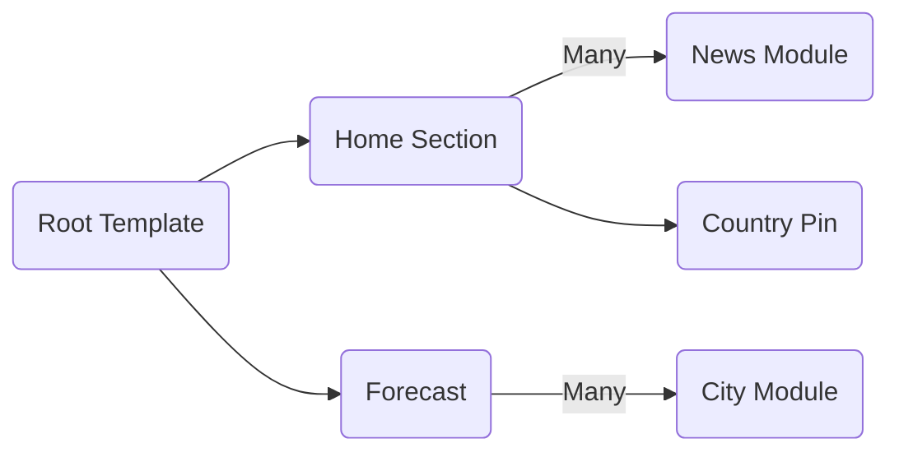

# Welcome to Weather Ui Toolkit System!
This is a Framework and Simple Ui made by Unity Ui Toolkit based on a [this UI Design].(https://www.behance.net/gallery/52326419/Weather-Forecast-Web).
My target was to create a Reusable framework for Ui Toolkit and create a demo project for others to show how to use it.


**Table Of Content:**
- [Features](#features)
- [How To Use](#how-to-use)
- [Contribution](#contribution)


# Features
## Resuable Framework
You can use the codes and also idea of project's problem solving for your future projects.

## Supports Template System
You can use a template as the Root for all of the Sections and the system will use it automatically for any instantiated Section or Module.


## Modular Architecture
Each window (Section) contains of different Modules which are all resuable in other Sections. These Modules are fully Encapsulated ane Responsible for their action without any dependency to other objects.
For example, in the above video, the Hierachy structure generated automatically and like below:


## Data Models
Based on a MVC like archticecture, each Module has a data binding with a Data Model. In this source code we implemented different modules based on their specific Data Models.
"Image of modules"g

## Alive and Dynamic Pages
All of the pages have diferent items with **Animations** and **Transitions**. Everything has been done very smooth and alive!

## Object Orientation
Sections and Modules are all inherted from their Base classes. You don't need to implement any extra thing! Most of things are exist in **Base Classes** and you just need to Customize them based on you needs.
"Image of inheritance architecture"

## Using World-Space Objects in UI Layers
There is a smooth combination of **World-Objects** with UI Elements in this source. For example some countries are pinned and highlighted in Ui layer which are rotating and moving based on the Earth Model.
"earth globe trackers"

## Well Documented Codes
I tried to make an Obvious and Clear Code in this source. But I put comment on every part of the code to make sure they are clear and understandable.
"image of comments"

You can rename the current file by clicking the file name in the navigation bar or by clicking the **Rename** button in the file explorer.

## Unique Id for each Dyanmically Generated Element

Any element which is generated by script, has a unique ID which can be used for any future access in your codes.

# How To Use
Clone the source code and open it in any Unity version. (Mine is 2023.3.15)
In order to open the **Sample Scene**, Open the following path: **Assets/_Project/Scenes/SampleScene.unity**

## Project Structure

- All of my Project files are located under **Assets/_Project/** directory.
- All of UI files are located under this directory: **Assets/_Project/Scripts/UIComponents**
- Directory Architecure for any UI element is like below:
  -- Root of each Section:  **Assets/_Project/Scripts/UIComponents/ [Section Name]**
  -- Controller Scripts (For the Section itself): **[Section Name] / Components**
  --- Module Scripts (Modules which used in that Section): **[Section Name] / Components / Modules**
  --- Data Model Scripts (Which are used in Modules): **[Section Name] / Components / DataModels**
  --- VisualTree of Modules (Modules which used in that Section): **[Section Name] / Components / Resources/VisualTrees**
  -- Style (USS) files of Section and Modules: **[Section Name] / Styles**
  -- VisualTree (UXML) files of Section: **[Section Name] / VisualTrees**

 ```mermaid
graph LR
A[Section Name] --> B(Components)
B --> C(Modules)
B --> D(DataModels)
B --> E(Resources) --> F(VisualTrees) --> G(Module Name)
A --> H(Prefabs)
A --> I(Styles)
A --> J(VisualTrees)
```

## Create a New Section
**Sections** are the Main panels which are Instantiated inside `Root Body` tag. They are designed for Landing pages and placeholder for merging Modules.
To Create a new Section.you have to follow these steps:

1.  Create a new VisualTree and a Style (Based on project structure)
2. Open this path:  ``Assets/_Project/Scripts/UIComponents/_RootPanel/VisualTrees/_RootPanel.uxml``
3. Find this tag: ``Root -> Middle -> Body -> BodyScroll``
4. Instantiate your create Section,  **Dynamically** or **Manually** under this tag
5. Create an Script (Based on Project structure) and **Inherit** it from ``BaseUISection``
6. Override these functions based on Comments and Functionalities: ``Initialize()``, ``LoadModules()``, ``Deinitialize()``
7. Override ``EnterSection()`` and ``ExitSection()`` function in order to customize Enter and Exit process of a Section (For example, I use ScrollTo function inside EnterSection function inorder to rescroll parent ScrollView to my current Section)

> Don't forget to keep Base Call function in overrided methods. For example in overriding Initialize() function, keep base.Initialize() in the overrided method
>
## Run a Section

1. Call this function from out of the Section: ``Initialize()`` and pass Root Visual Tree to this function
2. Call ``EnterSection()`` function to activate current Section and it's functionality
3. When you want to close a Section, you Call ``ExitSection()``, Also if you want to remove all of the modules or remove any event, you can Override ``Deinitialize`` and Call it in ``ExitSection``

and attach it in this path **Dynamically** or **Manually**:  ``Assets/_Project/Scripts/UIComponents/_RootPanel/VisualTrees/_RootPanel.uxml``


## Create a New Module
1. Create a VisualTree for your module in **[Section Name] / Components / Resources/VisualTrees**
2. Create a Style for your module in  **[Section Name] / Styles**
3. Optional: Create a DataModel in **[Section Name] / Components / DataModels**
4. Create an Script and inherit from ``BaseUIModule``
5. Override these functinos: ``LoadModule()``, ``UnloadModule()`` and Insert/Remove data from DataModel to your elements
6. Call ``SetModulePath(string)`` inside your ``LoadModule()`` function and before ``base.LoadModule()`` to set Resource path of its VisualTree
7. If you want to access to module's VisualTree elements **Before** Instatiation, you can use ``GetPreInsertContainer()`` method. Any changes will be displayed after calling ``InsertVisualElement()`` function.
8. If you want to access to module's VisualTree elemens **After** Instantitaion, you can use ``GetInsertedContainer()`` method. Any changes will be displayed at the moment of chaning.

> Don't forget to keep Base Call function in overrided methods. For example in overriding LoadModule() function, keep base.LoadModule() in the overrided method

## Use a Module
In your **Section** script:

1. Use ``AddModule<Type>()`` and ``GetModules<Type>()`` to add a module to your section.
2. Set your data models or any required data
3. Call ``SetRoot()`` function and assign your Element which you want this module to be Instantiated in/
4. Call ``LoadModule()`` function to form the module.
5. Call ``InsertVisualElement()`` to Instantiate your module in assigned Root element.


# Contribution
I just made this project to have more training on new UI Toolkit system. Please feel free to use it in your projects and also correct my mistakes in this repo :)